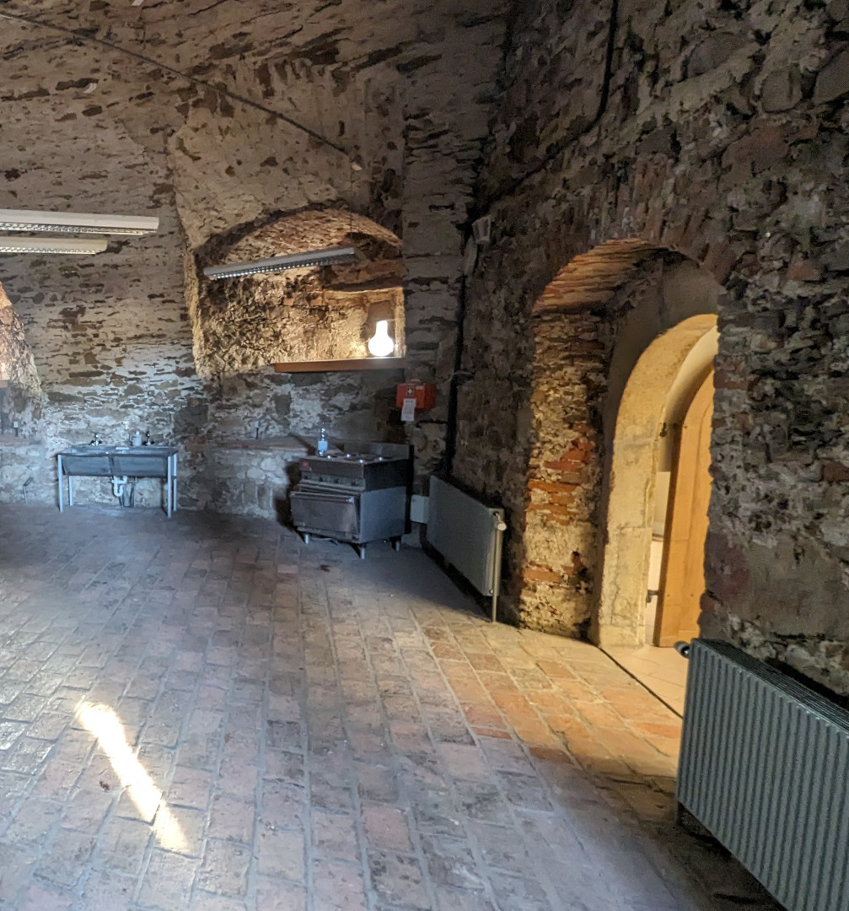
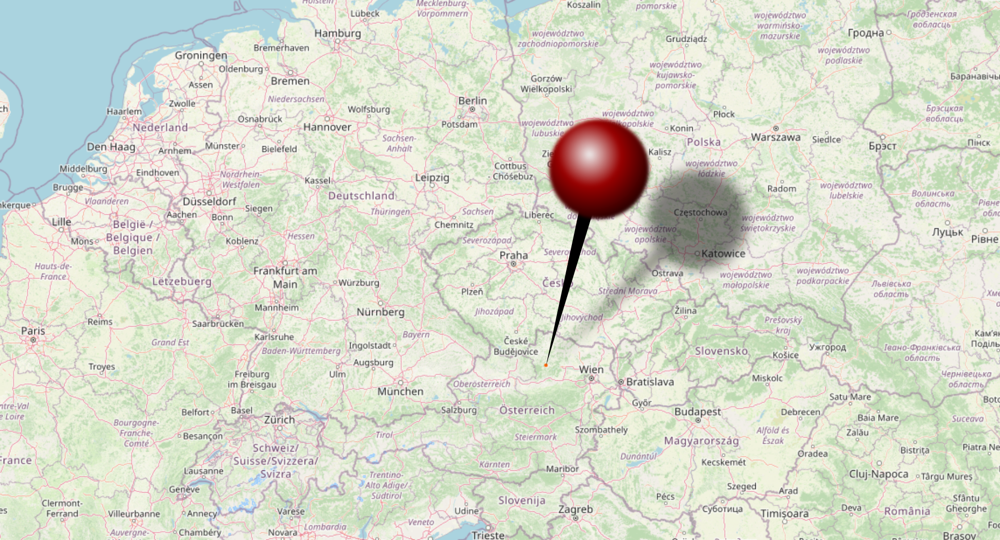
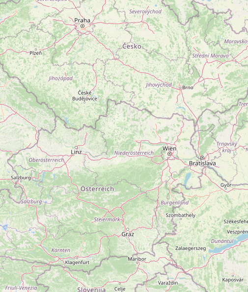
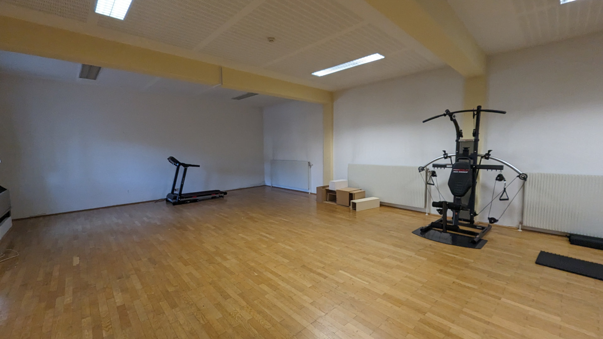

<!-- _class: centered -->

---

---

---
<!-- 
_backgroundColor: #FAFAFA;
-->

# Workshops & Hacking

- Hacker-Infrastructure (Fibre-Internet, DMX, etc)
- Castle-Workshop-Rooms

# Party

- Party Towers

The only thing missing, are you!

---

# People
<!-- 
_backgroundColor: #FAFAFA;
-->

- 450 Tickets
- camping
- sleeping hall dormitory
- limited amount of hotel rooms (50ppl)

---

---
<!-- 
_backgroundColor: #FAFAFA;
-->

# When

- 2024
- Last week in August
- August 28. to September 1

---

<!-- 
_backgroundColor: #FAFAFA;
_footer: Image: CC-BY-SA 2.0 OpenStreetMap
-->

---

<!-- 
_backgroundColor: #FAFAFA;
_footer: Image: CC-BY-SA 2.0 OpenStreetMap
-->

# Location

Schloss Ottenschlag
- between Linz and Vienna

reachable by
- car
- train + shuttle-bus

---
<!-- 
_backgroundColor: #FAFAFA;
-->

The only thing missing is you!

---

