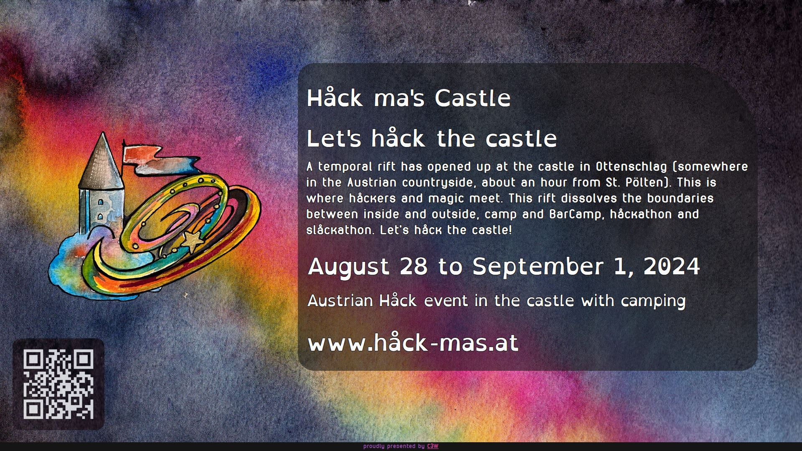

<!-- _class: centered -->

---

---

---

---
<!-- 
_backgroundColor: #FAFAFA;
-->

Workshops - Hacking - Party

- 400 glückliche Camper
- 50 Betten
- (vermutlich) Schlafhallen
- Schalldichte Türme
  - PARTY yay! 🎉
- Glasfaser

Jetzt fehlst nur noch du <3

---

